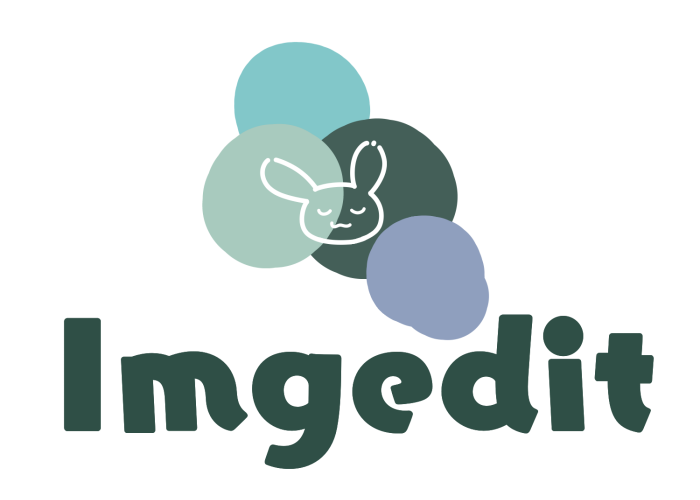

<div align="center" style="width: 100%;">
 
</div>


[](https://badge.fury.io/go/github.com%2Ficemint0828%2Fimgedit)
[](https://github.com/icemint0828/imgedit/actions/workflows/go.yml)
[](https://goreportcard.com/report/github.com/icemint0828/imgedit)
[](https://codecov.io/gh/icemint0828/imgedit)
[](https://www.codefactor.io/repository/github/icemint0828/imgedit)
[](https://golangexample.com/imgedit-a-package-that-performs-image-processing-such-as-resizing-and-trimming)
[](https://opensource.org/licenses/MIT)

## Overview

`Imgedit` is a package that performs image processing such as resizing and trimming available on both CLI and [GUI](#usage-gui).

## Features

- resize
- trim
- tile (lay down images)
- reverse (`vertical`, `horizon`)
- ~~grayscale~~
- add string
- filter (`gray`, `sepia`)
- interactive file format conversion (`png`, `jpeg`, `gif`)

 <table>
    <tr>
      <td>resize</td>
      <td>trim</td>
      <td>tile</td>
    </tr>
    <tr>
      <td></td>
      <td></td>
      <td></td>
    </tr>
    <tr>
      <td>reverse horizon</td>
      <td>reverse vertical</td>
      <td>add string</td>
    </tr>
    <tr>
      <td></td>
      <td></td>
      <td></td>
    </tr>
    <tr>
      <td>filter gray</td>
      <td>filter sepia</td>
      <td></td>
    </tr>
    <tr>
      <td></td>
      <td></td>
      <td></td>
    </tr>
 </table>

## Usage (Package)

```shell
$ go get github.com/icemint0828/imgedit@v1.4.0
```

An example with file conversion is as follows.

```go
package main

import (
    "github.com/icemint0828/imgedit"
)

func main() {
    fc, _, err := imgedit.NewFileConverter("srcImage.png")
    if err != nil {
        panic(err)
    }
    fc.Filter(imgedit.GrayModel)
    err = fc.SaveAs("dstImage.png", imgedit.Png)
    if err != nil {
        panic(err)
    }
}
```

It can also work with just convert bytes through io.Writer and io.Reader.

```go
package main

import (
	"bytes"
	"os"

	"github.com/icemint0828/imgedit"
)

func main() {
	srcFile, err := os.Open("srcImage.png")
	if err != nil {
		panic(err)
	}
	defer srcFile.Close()

	bc, _, err := imgedit.NewByteConverter(srcFile)
	bc.ResizeRatio(0.5)

	buffer := bytes.NewBuffer([]byte{})
	_ = bc.WriteAs(buffer, imgedit.Jpeg)

	dstFile, err := os.Create("dstImage.png")
	if err != nil {
		panic(err)
	}
	defer dstFile.Close()

	_, _ = buffer.WriteTo(dstFile)
}

```

It can also work with just convert image.

```go
package main

import (
    "image/png"
    "os"

    "github.com/icemint0828/imgedit"
)

func main() {
    srcFile, err := os.Open("srcImage.png")
    if err != nil {
        panic(err)
    }
    defer srcFile.Close()
    srcImage, err := png.Decode(srcFile)
    if err != nil {
        panic(err)
    }

    c := imgedit.NewConverter(srcImage)
    c.Resize(500, 500)
    dstImage := c.Convert()

    dstFile, err := os.Create("dstImage.png")
    if err != nil {
        panic(err)
    }
    defer dstFile.Close()
    err = png.Encode(dstFile, dstImage)
    if err != nil {
        panic(err)
    }
}
```

## Usage (CLI)

You can download the executable file from the link below.

- ### [Windows](https://github.com/icemint0828/imgedit/releases/latest/download/imgedit_Windows.zip)

- ### [Linux](https://github.com/icemint0828/imgedit/releases/latest/download/imgedit_Linux.zip)

- ### [mac OS](https://github.com/icemint0828/imgedit/releases/latest/download/imgedit_MacOS.zip)

Or if you can use `brew` on mac OS.

```shell
$ brew install icemint0828/tap/imgedit
```

For more information, please use the help command:

```shell
$ imgedit -help
```

## Usage (CLI on docker)

You can also run the CLI on docker.
This procedure can only convert files under the current working directory(WD).

```shell
$ docker run --rm -e WD=$(pwd) -v $(pwd):/mnt ghcr.io/icemint0828/imgedit:latest filter srcImage.png -mode gray
```

For more information, please use the help command:

```shell
$ docker run --rm -e WD=$(pwd) -v $(pwd):/mnt ghcr.io/icemint0828/imgedit:latest -help
```

## Usage (GUI)

You can also use a [sample GUI tool](https://github.com/icemint0828/imgedit-wasm) that is created with `WASM` by this package.

- ### Check out the [image edit tool](https://icemint0828.github.io/imgedit-wasm/)

## Known Limitations

- Smooth color conversion in `gif` files is not working well yet.

## Contributing

This project is currently at early stages and is being developed by internal members.

- Report your issues through [GitHub issues](https://github.com/icemint0828/imgedit/issues).

## License

`imgedit` is under [MIT license](https://github.com/icemint0828/imgedit/blob/main/LICENSE).
